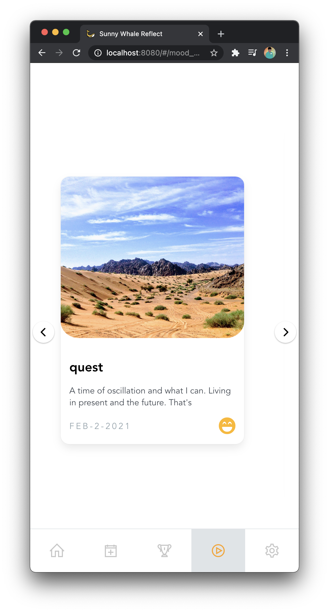
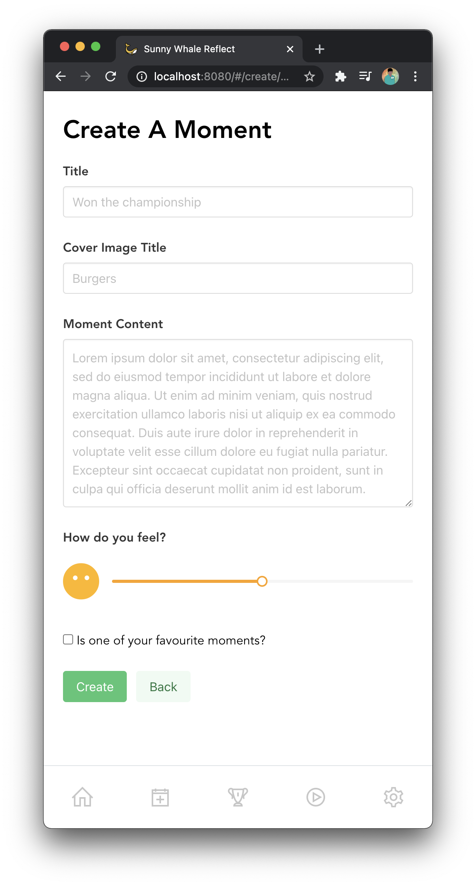

#  :muscle: 7 Day Challenge Supplement 
 

> A mood companion system  

## Overview
This year’s Student Council Mental Awareness Day initiative goes beyond a 45 min session and embarks on building a habit for life. With the spirit of mental well being, I’m proud to announce the launch of our very own mood companion system [Sunny Whale Reflect](https://reflect.sunnywhale.in). The app ties in with our idea of taking meaningful action post the session.

As part of the 7 Day challenge, students are to add [reflections and moments](#reflections-and-moments) daily for a week after which a [Mood Scape](#mood-scape) is generated along with graphical analysis of past moods. Through this, our student community has a fixed and shareable outcome and takeaway from the session.

The app is now live at https://reflect.sunnywhale.in. (*Both desktop and mobile devices are supported*)

Feel free to reach out to me at any time for questions or suggestions.

Below are further details and approaches to introduce the app to your respective classrooms.

## Features
1. [Daily Highlights](#daily-highlights)
2. [Reflections and Moments](#reflections-and-moments)
3. [Mood Synth](#mood-synth)
4. [Mood Scape](#mood-scape)
5. [Privacy](#privacy)
6. [Product Screenshots](#product-screenshots)

## Daily Highlights :calendar:
*Celebrate the glory of a moment and wind back time.*

Had an awesome birthday party last week? Relive it once again at time intervals (1 week,2 weeks,1 month, 3 months,6 months, 1 year).

## Reflections and Moments :trophy:
*Record the highlights of your day and the amazing moments of your life!*
Record occasions in a simple and accessible manner along with high quality images. 

- Reflections :- Daily reviews, highlights, productivity and happiness scores
- Moments :- Keystone experiences with deep emotional connections

## Mood Synth :star2:
*Travel back in time to understand the process when it matters the most.*
Using an emotion driven AI algorithm , the user is presented with set of moments in a life like manner, elevating the user’s mood in the process.

## Mood Scape :art:
*How do you feel?*
A visual representation of yous past week’s mood. AI generated and shareable with loved ones to promote openness of conversation in the space of mental well being.

## Privacy 🤫 
All user data is encrypted using AES-256-CBC encryption algorithm. All user data can be **deleted** at any time from the settings page. We do not share, record, analyse or sell any data. Google OAuth secures application data from snoopy actors. 

## Product Screenshots :camera:
*Home page*

*Reflections page*

*Moments page*

*Mood Synth*

*Create a moment*

*Settings page*

*Mood Scape*

